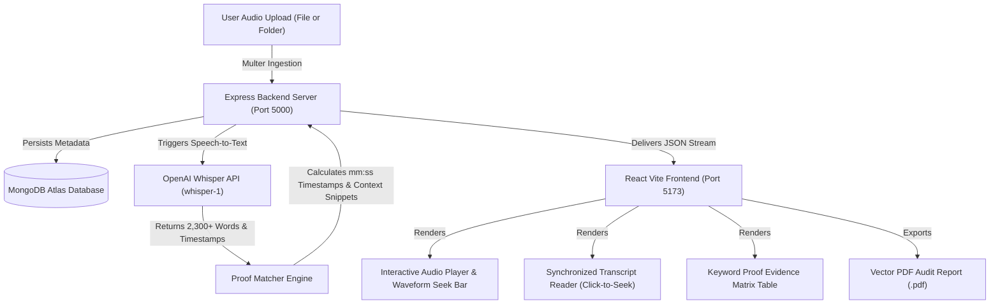

# 🎙️ AudioPulse — AI Audio Analysis, Keyword Intelligence & Proof Suite

> **AudioPulse** is a bank-grade acoustic intelligence web application designed for processing, transcribing, and auditing audio files and multi-file folders. Powered by **OpenAI Whisper API (`whisper-1`)**, **MongoDB Atlas**, **Express**, and **React (Vite)** with a state-of-the-art **Glassmorphism UI**, AudioPulse extracts word-level timestamps, verifies keyword proof evidence with surrounding context snippets, enables click-to-seek audio playback, and generates downloadable **PDF Audit Artifacts**.

---

## 🌟 Key Features

- **Folder & Multi-File Audio Ingestion**: Upload individual audio files or entire folder batches (`.mp3`, `.wav`, `.m4a`, `.flac`, `.ogg`).
- **OpenAI Whisper AI Transcription**: Uses OpenAI's `whisper-1` model with word-level timestamps (`verbose_json`) and context keyword prompts for high accuracy.
- **Custom Keyword Intelligence & Tagging**: Create, manage, and color-tag custom keyword groups (e.g., *Security Alerts*, *Financial Terms*, *Compliance & Audit*, *Customer Satisfaction*).
- **Keyword Proof Evidence Matrix**: Automatically calculates timestamp ranges (`mm:ss`), extracts context snippets with highlighted target terms, and computes a Reliability Index score.
- **Synchronized Click-to-Seek Playback**: Clicking any word in the transcript reader or any row in the proof table instantly seeks the HTML5 audio player to that exact second.
- **Vector PDF Audit Report Export**: 1-click generation of official compliance audit documents in `.pdf` format (using `jsPDF` and `autoTable`).
- **Single-Session & Admin Governance**: Role-based access control, pending approval workflow, admin audit panel, real-time API logging monitor, and single-session enforcement.
- **Dual-Theme Glassmorphism UI**: High-contrast Dark and Light themes with a custom segmented toggle switch (`[ ☀️ LIGHT | 🌙 DARK ]`).

---

## 🏗️ System Architecture



---

## 📂 Project Structure

```text
Vaibhav_Audio_Project/
├── backend/
│   ├── config/             # Database connection setup
│   ├── controllers/        # Audio, Auth, Keyword, Admin & Log Controllers
│   ├── middleware/         # Auth (JWT), Admin, & Logger Middlewares
│   ├── models/             # Mongoose Schemas (AudioAnalysis, KeywordGroup, User, Log)
│   ├── routes/             # Express API Route Declarations
│   ├── services/           # OpenAI Whisper Service & Proof Matcher Engine
│   ├── uploads/audio/      # Local Storage for Uploaded Audio Files
│   ├── server.js           # Main Express Application Entrypoint
│   ├── test_whisper.js     # Standalone CLI Test Script for OpenAI Whisper API
│   └── package.json
├── frontend/
│   ├── src/
│   │   ├── components/     # AudioPlayer, ProofTable, TranscriptViewer, KeywordManager, Modal, ThemeToggle
│   │   ├── context/        # Auth & Theme Context Providers
│   │   ├── pages/          # AudioWorkspace, AnalysisDetails, Login, Register, AdminPanel, ApiLogs
│   │   ├── styles/         # Glassmorphism Design System & CSS Variables (index.css)
│   │   └── App.jsx         # React Router Entry Point
│   └── package.json
├── package.json            # Root Package JSON for Render Deployment
├── render.yaml             # Render Blueprint Configuration File
└── README.md
```

---

## 🚀 Quick Start & Local Setup

### Prerequisites
- **Node.js**: `v18.0.0` or higher
- **npm**: `v9.0.0` or higher
- **MongoDB Atlas Connection URI**
- **OpenAI API Key** (from [platform.openai.com](https://platform.openai.com/account/api-keys))

---

### Step 1: Environment Configuration

Create a `.env` file inside the `backend/` directory:

```env
PORT=5000
NODE_ENV=development
MONGO_URI=your_mongodb_connection_string
JWT_SECRET=super_secret_jwt_key_audio_analysis_2026
ADMIN_NAME="Admin User"
ADMIN_EMAIL="admin@audioapp.com"
ADMIN_PASSWORD="Admin123!@#"

# OpenAI API Key (Required for live Whisper API speech-to-text)
OPENAI_API_KEY=sk-svcacct-YOUR_OPENAI_API_KEY
```

---

### Step 2: Install Dependencies & Run

#### Option A: Running Backend & Frontend Concurrently

1. **Install Backend Dependencies**:
   ```bash
   cd backend
   npm install
   npm run start
   ```

2. **Install Frontend Dependencies (in a new terminal)**:
   ```bash
   cd frontend
   npm install
   npm run dev
   ```

3. Open **`http://localhost:5173`** in your browser.

---

### Step 3: CLI Testing (OpenAI Whisper API)

To test your `OPENAI_API_KEY` directly from the command line against uploaded audio files:

```bash
cd backend
node test_whisper.js
```

---

## 🌐 Deploying to Render (Web Service)

This repository is pre-configured for 1-click deployment on **Render**:

1. **Push code to GitHub**: `git push origin main`
2. **Create Web Service on Render**: Connect your repo (`Audio Pulse`).
3. **Build Command**: `npm run build`
4. **Start Command**: `npm start`
5. **Add Environment Variables**: Set `NODE_ENV=production`, `MONGO_URI`, `JWT_SECRET`, and `OPENAI_API_KEY` in the Render dashboard.

---

## 📄 License & Attribution

Built with ❤️ for advanced acoustic intelligence, compliance auditing, and proof verification.
